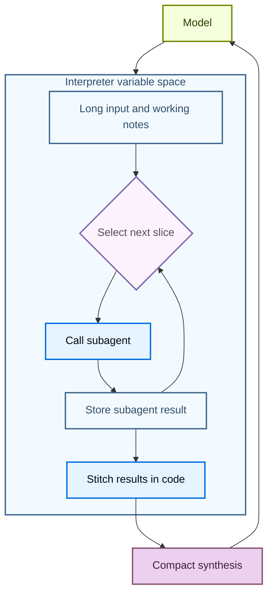
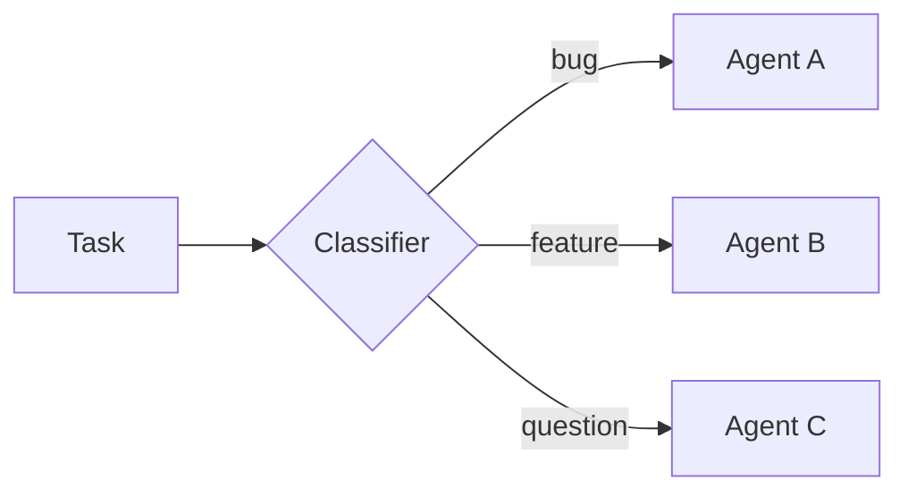
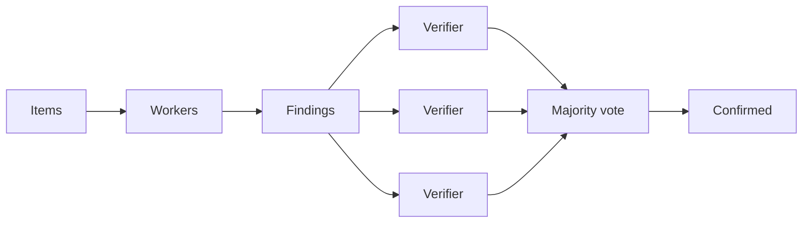
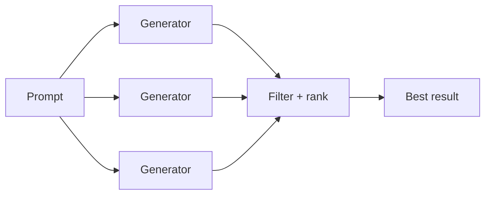
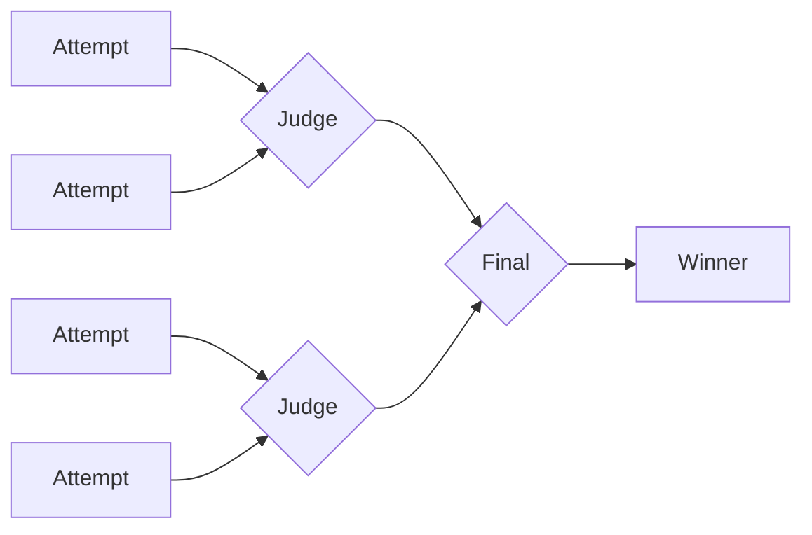
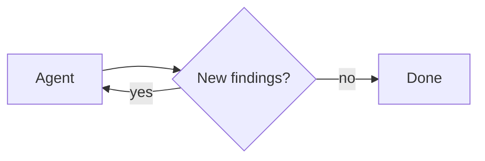

Interpreters give agents a programmable workspace where they can explore data, coordinate tool calls, and keep intermediate work out of the model context. The agent writes code to express its intent, then an **in-memory** runtime executes that code and returns the relevant results.

Where [sandboxes](/oss/javascript/deepagents/sandboxes) are a code-first way for acting on an environment (such as running commands, installing dependencies, and editing files), interpreters are a code-first way for acting inside the agent loop: composing tools, preserving state, and deciding what information should return to the model.

<Warning>
    Interpreters are in [**beta**](/oss/javascript/versioning). APIs and lifecycle behavior may change between releases.
</Warning>


## When to use an interpreter

Most agent work alternates between model reasoning and single tool calls. That breaks down when the agent needs to compose many steps, reason over structured data, or hold intermediate state. An interpreter gives it a runtime to do that work in code: run control flow, call allowlisted tools, store variables, and return only a compact result to the model.

Use interpreters when the agent needs to:

- Compose multiple tool calls with code, including loops, branching, retries, and concurrency.
- Coordinate subagents from code by splitting work into focused calls, storing their results, and stitching those results into a final synthesis.
- Keep intermediate values in runtime state instead of sending every temporary result back through the model context.
- Transform structured data deterministically, such as sorting, grouping, parsing, validating, scoring, or aggregating.
- Explore a large variable space and return only selected evidence, summaries, or outputs to the model.

Code runs against [**QuickJS**](https://github.com/quickjs-ng/quickjs), a lightweight JavaScript runtime with no access to the host filesystem, network, shell, or clock by default. Explicit bridges decide what the code can reach.

## Choose the right execution path

| Need | Use |
| --- | --- |
| One or two simple external calls | Normal tool calling |
| A small program that loops, branches, retries, or aggregates results | Interpreter |
| Many selected tool calls that should run from code | Interpreter with [programmatic tool calling](#programmatic-tool-calling) |
| Many independent units of work, or multiple perspectives on one task | Interpreter with [subagent orchestration](#orchestrate-subagents-from-code) |
| Shell commands, package installs, tests, or full OS filesystem access | [Sandboxes](/oss/javascript/deepagents/sandboxes) |

## Add an interpreter to an agent

Install the QuickJS middleware package, then pass interpreter middleware using the `middleware` argument on `create_deep_agent`.


<CodeGroup>
```bash npm
npm install deepagents @langchain/quickjs
```

```bash pnpm
pnpm add deepagents @langchain/quickjs
```

```bash yarn
yarn add deepagents @langchain/quickjs
```
</CodeGroup>

```typescript
import { createDeepAgent } from "deepagents";
import { createCodeInterpreterMiddleware } from "@langchain/quickjs";

const agent = createDeepAgent({
  model: "openai:gpt-5.4",
  middleware: [createCodeInterpreterMiddleware()],
});
```


## Run code in the interpreter

The middleware adds an `eval` tool to the agent. The tool runs JavaScript in a persistent context, captures `console.log`, and returns the result of the last expression.

The agent can write code like this:

```javascript
const rows = [
  { team: "alpha", score: 8 },
  { team: "beta", score: 13 },
  { team: "alpha", score: 21 },
];

const totals = rows.reduce((acc, row) => {
  acc[row.team] = (acc[row.team] ?? 0) + row.score;
  console.log(`${row.team} score: ${acc[row.team]}`)
  return acc;
}, {});

totals;
```


## What interpreter code can reach

By default, interpreter code runs against QuickJS with no access to the host filesystem, network, shell, package manager, or clock. It can compute, hold state, and write to `console.log`, and nothing more.

Two explicit bridges extend that reach:

- **Tools**, through [programmatic tool calling](#programmatic-tool-calling). Expose an allowlist of tools as async functions under the `tools` namespace. These can be the agent's own tools or standalone tools you define and pass in.
- **Subagents**, through the built-in [`task()` global](#orchestrate-subagents-from-code). Dispatch configured subagents from code and orchestrate them in plain JavaScript.

Programmatic tool calling is off until you pass an allowlist. Subagent dispatch is on by default whenever the agent has subagents, and you can turn it off. Nothing else crosses the QuickJS boundary unless you expose it.

## Programmatic tool calling

Programmatic tool calling (PTC) exposes selected agent tools inside the interpreter under the global `tools` namespace. Instead of asking the model to issue one tool call, wait for the result, and then decide the next call, the agent can write code that calls tools in loops, branches, retries, or parallel batches.

This helps when intermediate results are only inputs to the next step: the interpreter filters or aggregates them before anything returns to the model, keeping multi-step workflows token efficient. It is model-agnostic, implemented by middleware rather than a provider-specific tool-calling API.

The middleware exposes each allowlisted tool as an async function under `tools`. The agent calls it with `await`, processes the result in code, and the model sees only the final interpreter output, not every intermediate value. Tool names are converted to camel case while the input object still follows the tool's schema, so a tool named `web_search` becomes `tools.webSearch(...)`:

```typescript
const result: string = await tools.webSearch({
  query: "deepagents interpreters",
});
```

### Enable PTC

Enable PTC with an explicit allowlist:


```typescript
import { createDeepAgent } from "deepagents";
import { createCodeInterpreterMiddleware } from "@langchain/quickjs";

const agent = createDeepAgent({
  model: "openai:gpt-5.4",
  middleware: [createCodeInterpreterMiddleware({ ptc: ["web_search"] })],
});
```


After PTC is enabled, the agent can call the allowlisted tool from interpreter code. This example searches several topics in parallel and combines the results before returning to the model:

```javascript
const topics = ["retrieval", "memory", "evaluation"];

const results = await Promise.all(
  topics.map((topic) =>
    tools.webSearch({ query: `${topic} best practices 2025` }),
  ),
);

results.join("\n\n");
```

<Warning>
    PTC calls currently execute through the interpreter bridge and do not go through the normal tool calling path. As a result, `interrupt_on` approval workflows are not enforced per PTC-invoked tool call.
</Warning>

## Orchestrate subagents from code

When an agent has [subagents](/oss/javascript/deepagents/subagents) and interpreter middleware, the interpreter exposes a built-in `task()` global that dispatches subagents from code. A task spanning many independent units (reviewing every file in a directory, triaging a batch of tickets) becomes a loop that fans the work out, so it runs deterministically instead of one model-chosen tool call at a time.

### The `task()` global

`task()` takes the prompt the subagent receives (`description`), which configured subagent to run (`subagentType`), and an optional `responseSchema` for structured output. It runs a full agentic loop and resolves to the subagent's result:

```javascript
const review = await task({
  description: "Review src/auth/login.ts for auth issues. Cite line numbers.",
  subagentType: "reviewer",
  responseSchema: {
    type: "object",
    properties: {
      issues: { type: "array", items: { type: "object", properties: {
        file: { type: "string" }, line: { type: "number" },
        severity: { type: "string" }, description: { type: "string" },
      }}},
    },
  },
});

// With responseSchema, the result is already a typed value, so no JSON.parse is needed.
const critical = review.issues.filter((issue) => issue.severity === "high");
```

When you pass `responseSchema`, the resolved value is already a typed JavaScript object; only call `JSON.parse` if a subagent intentionally returned a JSON string.

### Steering orchestration

The interpreter middleware ships orchestration guidance in the system prompt, so the agent already knows how to fan out in bounded batches, filter between passes, and synthesize results. You don't hand-write that logic or prompt for it turn by turn.

To shape *what* the agent orchestrates, work through the inputs it already responds to:

- **The subagents you configure.** Their `name` and `description` define the roles available. A `reviewer` paired with a `verifier` invites a two-pass check; a single `analyzer` invites a straight fan-out.
- **The task message.** Phrasing like "I only want confirmed issues, not maybes" or "be exhaustive" nudges the agent toward verification or an open-ended sweep.
- **The system prompt.** Use `systemPrompt` (or the agent's instructions) to add standing guidance when you want a consistent strategy across runs.

### Working with large inputs

The same `task()` mechanism handles inputs too large to reason over in one pass, the approach described in the [Recursive Language Models paper](https://arxiv.org/abs/2512.24601). Keep the large input or working set in interpreter variables (the *variable space*, distinct from the model's context), then let the model inspect it, split it into slices, dispatch a subagent per slice, and stitch the returned results back together.



The recursive call is just `task()` over slices. The interpreter calls a subagent for each one, combines their answers, and returns a single synthesized result:

```javascript
const candidates = notes
  .filter((note) => note.includes("migration"))
  .slice(0, 5);

const riskReports = await Promise.all(
  candidates.map((note) =>
    task({
      description: `Analyze this migration note for release risk. Return risks, affected users, and recommended follow-up:\n\n${note}`,
      subagentType: "general-purpose",
    }),
  ),
);

const releaseSummary = riskReports
  .map((report, index) => `## Candidate ${index + 1}\n${report}`)
  .join("\n\n");

releaseSummary;
```

### Orchestration patterns

The agent picks a strategy from the shape of the task; these emerge from how it writes interpreter code, not from configuration, and the subagents you make available determine what it can do. Every pattern shares one model: hold work in JS variables, dispatch subagents with `task()`, and combine results in code. The diagrams below show the common shapes, each with a runnable example.

#### Classify and act

Items are classified first, then each is handled by a specialized subagent based on its classification. This lets you process mixed inputs where different items need different expertise.



**Use cases:** Triaging support tickets, error logs, user feedback, or any batch of items that need different handling depending on their type.

<Accordion title="Example: classify and act">


```typescript
const agent = createDeepAgent({
  model: "openai:gpt-5.4",
  subagents: [
    {
      name: "bug-fixer",
      description: "Investigates bug reports and provides reproduction steps",
      systemPrompt: "You are a bug triage specialist. Investigate each bug report and provide clear reproduction steps.",
    },
    {
      name: "feature-analyst",
      description: "Evaluates feature requests for feasibility and effort",
      systemPrompt: "You are a product analyst. Evaluate each feature request for technical feasibility, estimated effort, and potential impact.",
    },
    {
      name: "support-agent",
      description: "Answers user questions based on documentation",
      systemPrompt: "You are a support specialist. Answer user questions clearly based on the available documentation.",
    },
  ],
  middleware: [createCodeInterpreterMiddleware()],
});

const result = await agent.invoke({
  messages: [{ role: "user", content: "Go through these 30 support tickets. Categorize each one, then for bugs give me reproduction steps, and for feature requests give me a feasibility assessment." }],
});
```

</Accordion>

#### Fan-out and synthesize

The agent dispatches the same kind of work across many items in parallel, then combines the results.


**Use cases:** Code review across a directory, analyzing a batch of documents, processing log files, running the same check across many services.

<Accordion title="Example: fan-out and synthesize">


```typescript
import { createDeepAgent } from "deepagents";
import { createCodeInterpreterMiddleware } from "@langchain/quickjs";

const agent = createDeepAgent({
  model: "openai:gpt-5.4",
  subagents: [{
    name: "reviewer",
    description: "Reviews code for security issues, citing lines and severity",
    systemPrompt: "You are a security-focused code reviewer. Read the file carefully and report any authentication or authorization issues with line numbers and severity.",
  }],
  middleware: [createCodeInterpreterMiddleware()],
});

const result = await agent.invoke({
  messages: [{ role: "user", content: "Review all the route handlers in src/routes/ for authentication issues. Summarize the top risks." }],
});
```

</Accordion>

#### Adversarial verification

A two-pass pattern. The first pass produces findings. The second pass sends each finding to independent verifiers, and only findings that survive agreement are kept. This reduces false positives when confidence matters more than speed.



**Use cases:** Security audits where false positives are costly, compliance checks, any review where you need high confidence in findings.

<Accordion title="Example: adversarial verification">


```typescript
const agent = createDeepAgent({
  model: "openai:gpt-5.4",
  subagents: [
    {
      name: "reviewer",
      description: "Finds potential security vulnerabilities in code",
      systemPrompt: "You are a security auditor. Find potential vulnerabilities and report each with file, line, and description.",
    },
    {
      name: "verifier",
      description: "Independently verifies whether a reported vulnerability is real",
      systemPrompt: "You are a security verification specialist. Given a reported vulnerability, independently verify whether it is exploitable. Be skeptical. Only confirm real issues.",
    },
  ],
  middleware: [createCodeInterpreterMiddleware()],
});

const result = await agent.invoke({
  messages: [{ role: "user", content: "Do a thorough security audit of the payments module. I only want confirmed vulnerabilities, not maybes." }],
});
```

</Accordion>

#### Generate and filter

Multiple subagents generate independent solutions to the same problem. The agent compares, scores, and filters the results in code, keeping only the best.



**Use cases:** Architecture proposals, refactoring strategies, content variations, any task where exploring multiple options before committing produces a better outcome.

<Accordion title="Example: generate and filter">


```typescript
const agent = createDeepAgent({
  model: "openai:gpt-5.4",
  subagents: [{
    name: "architect",
    description: "Proposes a database schema design with tradeoff analysis",
    systemPrompt: "You are a database architect. Propose a schema design for the given requirements. Include tradeoffs, migration considerations, and a clear rationale.",
  }],
  middleware: [createCodeInterpreterMiddleware()],
});

const result = await agent.invoke({
  messages: [{ role: "user", content: "Generate three different approaches to restructure the database schema for the orders system, then pick the best one." }],
});
```

</Accordion>

#### Tournament

Variations are compared head-to-head by a judge subagent, with winners advancing through elimination rounds.



**Use cases:** Optimization under subjective criteria, style selection, choosing between competing implementations.

<Accordion title="Example: tournament">


```typescript
const agent = createDeepAgent({
  model: "openai:gpt-5.4",
  subagents: [
    {
      name: "writer",
      description: "Rewrites a function with a focus on readability and clarity",
      systemPrompt: "You are an expert programmer focused on clean code. Rewrite the given function to maximize readability. Explain your choices.",
    },
    {
      name: "judge",
      description: "Compares two code implementations and picks the more readable one",
      systemPrompt: "You are a code quality judge. Compare two implementations and pick the more readable one. Justify your choice with specific criteria.",
    },
  ],
  middleware: [createCodeInterpreterMiddleware()],
});

const result = await agent.invoke({
  messages: [{ role: "user", content: "Rewrite the processOrder function in src/checkout.ts five different ways and find the most readable version." }],
});
```

</Accordion>

#### Loop until done

The agent runs a discovery loop, deduplicating against what it has already found, until no new results appear. Useful when the scope of the work isn't known upfront.



**Use cases:** Exhaustive search, dead code detection, dependency audits, any sweep where you want completeness rather than a fixed number of results.

<Accordion title="Example: loop until done">


```typescript
const agent = createDeepAgent({
  model: "openai:gpt-5.4",
  subagents: [{
    name: "analyzer",
    description: "Analyzes code for unused exports, functions, and dead code paths",
    systemPrompt: "You are a code analyst specializing in dead code detection. Find unused exports, unreachable functions, and orphaned modules. Report each with file path and evidence.",
  }],
  middleware: [createCodeInterpreterMiddleware()],
});

const result = await agent.invoke({
  messages: [{ role: "user", content: "Find all the dead code in this repo. Be thorough. I want every unused export and unreachable function." }],
});
```

</Accordion>

<Warning>
    `task()` dispatches from inside an already-running `eval` call. It does not go through the normal tool calling path, so `interrupt_on` approval workflows on the parent agent are not enforced per dispatch. Gate the `eval` tool itself if you need approval before subagent orchestration runs.
</Warning>


## Security and limits

Interpreters use QuickJS to run untrusted JavaScript with strict default isolation. Treat that as a scoped interpreter runtime, not a full production sandbox backend.

Every tool you expose through PTC is an outside capability that interpreter code can use. Treat the PTC allowlist as a permission boundary: expose only the tools the agent needs, and avoid bridging broad tools that can access sensitive systems, spend money, mutate data, or call unrestricted networks unless that behavior is intentional.


| Capability | Available by default | How to expose it |
| --- | --- | --- |
| JavaScript execution | Yes | Add interpreter middleware |
| Top-level `await` | Yes | Use promises in interpreter code |
| `console.log` capture | Yes | Disable with `captureConsole: false` |
| Agent tools | No | Add a PTC allowlist |
| Filesystem access | No | Add the [built-in filesystem tools](/oss/javascript/deepagents/harness#virtual-filesystem-access) via the PTC allowlist |
| Network access | No | Expose a specific network tool through PTC |
| Wall-clock or datetime access | No | Expose an explicit time tool if needed |
| Shell commands, package installs, tests, OS-level execution | No | Use a [sandbox backend](/oss/javascript/deepagents/sandboxes) |


## Middleware options


`createCodeInterpreterMiddleware` accepts the following options:

| Option | Default | Purpose |
| --- | --- | --- |
| `ptc` | omitted | PTC allowlist: array of tool names or `StructuredToolInterface` instances. |
| `memoryLimitBytes` | `64 * 1024 * 1024` <br/>(64 MB) | QuickJS memory limit in bytes. |
| `maxStackSizeBytes` | `320 * 1024` | QuickJS stack size limit in bytes. |
| `executionTimeoutMs` | `5000` | Per-eval timeout in milliseconds. Negative values disable the timeout. |
| `systemPrompt` | `null` | Override the built-in interpreter system prompt. |
| `maxPtcCalls` | `256` | Maximum `tools.*` calls per eval. Use `null` only in trusted environments. |
| `maxResultChars` | `4000` | Maximum characters retained from console output, result, and error strings. |
| `toolName` | `"eval"` | Name of the interpreter tool exposed to the model. |
| `captureConsole` | `true` | Whether `console.log`, `console.warn`, and `console.error` output is captured. |
| `subagents` | `true` | Expose the built-in `task()` global for [subagent orchestration](#orchestrate-subagents-from-code). Set to `false` to require subagent dispatch through the normal `task` tool path. |

---

<div className="source-links">
<Callout icon="terminal-2">
    [Connect these docs](/use-these-docs) to Claude, VSCode, and more via MCP for real-time answers.
</Callout>
<Callout icon="edit">
    [Edit this page on GitHub](https://github.com/langchain-ai/docs/edit/main/src/oss/deepagents/interpreters.mdx) or [file an issue](https://github.com/langchain-ai/docs/issues/new/choose).
</Callout>
</div>
